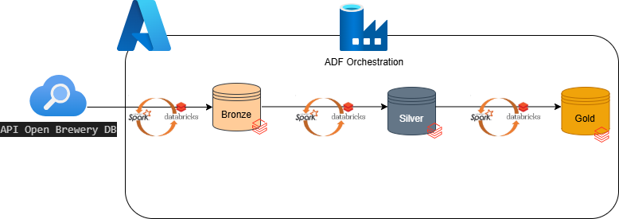
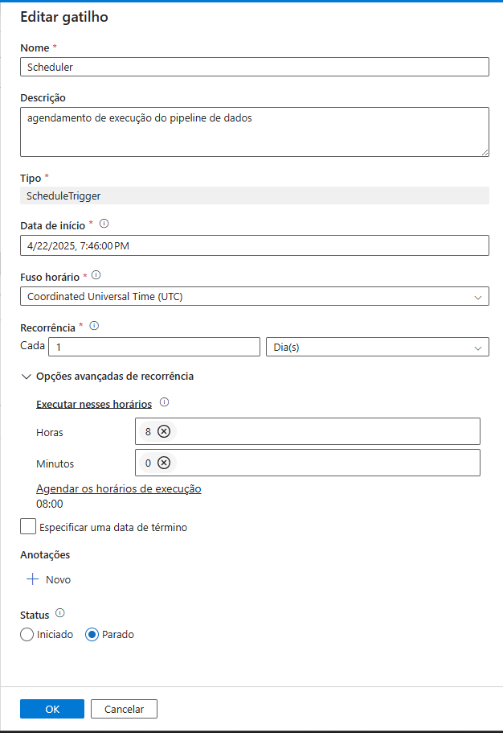
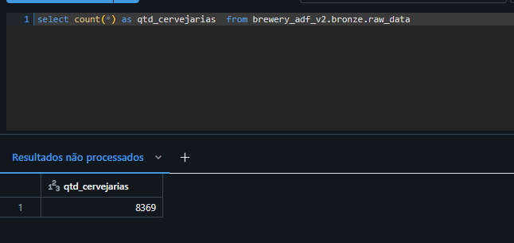
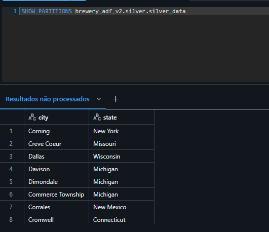
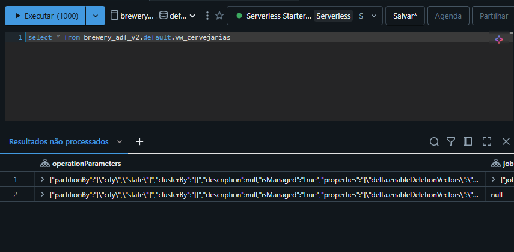
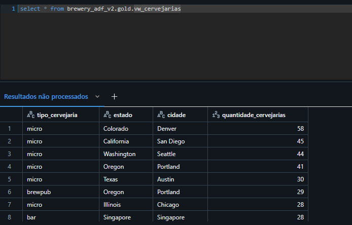
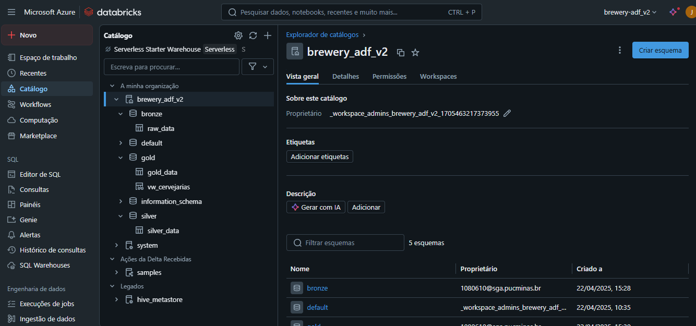

# Technical Case: Breweries Case – Usando Databricks e Azure Data Factory para dados de API

## Visão Geral do Projeto
Este projeto implementa um pipeline de dados para consumir informações sobre cervejarias através da API Open Brewery DB, processá-las e armazená-las em um data lake utilizando a arquitetura medallion (camadas Bronze, Silver e Gold). A solução faz uso do Azure Databricks para o processamento com PySpark e da Azure Data Factory para orquestração do pipeline de dados.

## Arquitetura

A arquitetura da solução segue o modelo Medallion Architecture, sendo composta por três camadas principais: Bronze, Silver e Gold. A plataforma escolhida para o processamento é o Azure Databricks, enquanto a orquestração é feita via Azure Data Factory (ADF). O armazenamento dos dados é realizado no Databricks File System (DBFS).
## Camada Bronze — Dados Brutos
Objetivo: Armazenar os dados brutos obtidos da API sem qualquer transformação, preservando o formato original para análises futuras.
-	Formato: Delta table.
-	Detalhes:
    -	Dados extraídos da API pública da Open Brewery DB com paginação automatizada.
    -	Nenhuma transformação é aplicada nesta camada.
    -	Arquivos são armazenados no DBFS na camada Bronze.

## Camada Silver — Dados Processados
Objetivo: Limpar, normalizar e particionar os dados para garantir consistência e qualidade para as análises.
-	Formato: Delta table.
-	Transformações Aplicadas:
    -	Remoção de campos nulos irrelevantes.
    -	Conversão de tipos de dados para um formato padrão.
    -	Particionamento dos dados por state (estado) e city (cidade) para facilitar o processamento e análise de dados.
## Camada Gold — Dados Agregados
Objetivo: Gerar uma camada analítica com dados agregados para fornecer insights de negócio.
-	Formato: Delta table e view.
-	Transformações Aplicadas:
    -	Contagem de cervejarias por brewery_type (tipo de cervejaria) e local (por state e city).

## Orquestração com Azure Data Factory
A orquestração do pipeline é feita através do Azure Data Factory (ADF), utilizando um pipeline com as seguintes atividades principais:
Pipeline ADF
O pipeline contém três atividades principais:
1.	Ingestão da camada Bronze:
-	Executa o notebook bronze_extraction.py, que consome os dados da Open Brewery DB API e armazena os dados brutos na camada Bronze.
2.	Transformação da camada Bronze para Silver:
-	Executa o notebook silver_transformation.py, que realiza a limpeza e normalização dos dados, além de particioná-los por state e city.
3.	Agregação da camada Silver para Gold:
-	Executa o notebook gold_aggregation.py, que gera agregações por brewery_type, state e city, e armazena o resultado na camada Gold, tanto em formato de Delta table quanto em uma view.

## Controle de Fluxo e Tratamento de Erro
-	Controle de fluxo: O pipeline é configurado para garantir que as atividades sejam executadas na ordem correta.
-	Retries automáticos: As atividades possuem configurações de retries automáticos em caso de falhas para garantir a robustez do processo.
-	Alertas: Em caso de falha, alertas por e-mail são disparados via integração com o Azure Monitor, garantindo a visibilidade dos problemas.
## Trigger de Execução
-	A execução do pipeline é agendada para rodar diariamente às 08:00h (ou sob demanda, dependendo da necessidade).

## Notebooks Databricks
bronze_extraction.py
-	Objetivo: Consumir os dados da API pública da Open Brewery DB e armazená-los na camada Bronze.
-	Características:
    -	Lida com paginação automática para garantir que todos os registros sejam recuperados.
    -	Armazena os dados brutos no formato Delta table no caminho específico da camada Bronze do Unity Catalog.

silver_transformation.py
-	Objetivo: Realizar a transformação dos dados da camada Bronze para Silver, limpando e normalizando os dados.
-	Características:
    -	Lê os dados da camada Bronze armazenados em formato Delta table.
    -	Aplica limpeza (remoção de dados nulos irrelevantes), normalização (padronização de tipos de dados) e particionamento (por estado e cidade).
    -	Os dados são então escritos de volta em uma Delta table particionada.

gold_aggregation.py
-	Objetivo: Agregar os dados da camada Silver para fornecer insights analíticos na camada Gold.
-	Características:
    -	Lê os dados da camada Silver.
    -	Aplica agregações como contagem de cervejarias por tipo (brewery_type) e localização (estado e cidade).
    -	Armazena os resultados na camada Gold, tanto em formato Delta table quanto em uma view, para facilitar a consulta por stakeholders.

Após a execução dos notebooks teremos um Catálago de dados no databricks semelhante ao apresentado na imagem abaixo:

## Monitoramento e Alertas
Para garantir a integridade dos dados e a execução correta do pipeline, foram implementados processos de monitoramento e alertas.
Monitoramento via Azure Data Factory (ADF)
-	Retry automático: Em caso de falhas nas atividades do pipeline, o ADF está configurado para tentar novamente automaticamente, minimizando interrupções.
-	Alertas de falhas: Através da integração com o Azure Monitor, alertas são disparados para um grupo de e-mail configurado sempre que uma falha ocorre no pipeline.
Validações de Dados
-	Verificação de quantidade mínima de registros por camada: Cada camada do pipeline (Bronze, Silver e Gold) possui uma validação para garantir que os dados processados não estejam vazios ou com quantidade de registros abaixo do esperado.
-	Checagem de schema esperado: Antes de avançar para as camadas seguintes, um processo de validação é executado para garantir que os dados estejam no formato e schema esperados.
-	Consistência dos dados: São realizadas verificações de consistência para assegurar que os dados não foram corrompidos durante as transformações ou ingestão.

## Considerações Finais
Este pipeline de dados foi projetado para ser escalável e resiliente, utilizando as melhores práticas de engenharia de dados na plataforma Azure. Ele pode ser facilmente estendido para incluir novas fontes de dados ou transformações adicionais, conforme necessário. A utilização do Azure Databricks e Azure Data Factory garante não apenas a performance e flexibilidade, mas também o controle e monitoramento eficazes de cada etapa do processo.
Algumas etapas deste processo não puderam ser implementadas devido as restrições da conta disponível para desenvolvimento, porém, foram desenvolvidos mecanismos paralelos que possibilitassem teste e validações dos processes extração, tratamento e armazenamento dos dados

